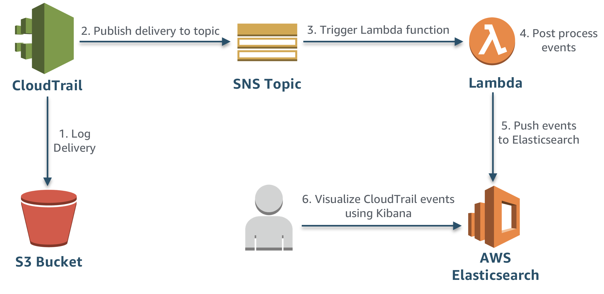

# Processing CloudTrail Logs with AWS Lambda

This serverless application creates the necessary resources and integrations for properly enabling and processing CloudTrail logs in your environment. The below architecture showcases how logs are stored, post-processed, and push to Elasticsearch.

## Architecture



## Prerequisites

Below are the necessary prerequisites:

*	[AWS Account](https://aws.amazon.com/premiumsupport/knowledge-center/create-and-activate-aws-account/)
*	[Serverless Framework](https://serverless.com/)

### Cloud9 Environment

If you are having trouble installing any of the prerequisites, you can spin up an [AWS Cloud9](https://aws.amazon.com/cloud9/) environment, which is a cloud-based IDE that comes prepackaged with a number of essential packages.  After which you can run the following to install the Serverless Framework.

```
npm install -g serverless
```

## Set Variables

Open up **environment/dev.yml** and add in the appropiate variables. 

>  You can add new files for different environments.

## Install Dependencies

After cloning the repo, change to the aws-ct-processing directory and run the following to install the dependencies:

```
pip install -r requirements.txt -t ./
```

> If you are using Mac OS X and installed Python using Homebrew, you'll need to add a setup.cfg in the aws-ct-processing directory with the following:

```
[install]
prefix=
```

## Deploy

To deploy the serverless application, run the following command:

```
sls deploy -s dev -r us-west-2
```

> If you've created different environment files that reference other aws profiles or you want to deploy to different regions, you can replace *dev* and *us-west-2* as necessary.

## Access

After to the application has been successfully deployed you can view the logs in Kibana by doing the following:

* Go to the [AWS Elasticsearch](https://us-west-2.console.aws.amazon.com/es/home?region=us-west-2) console.
* Click on the Domain that starts with **sls-aws-ct-processing**.
* Click the link next to **Kibana**.

Once you are in Kibana:

* For **Index name or pattern** type **logs-\***.
* For **Time Filter field name** select **@timestamp**.
* Click **Create**.
* On the left navigation, click **Discover** to view your events.