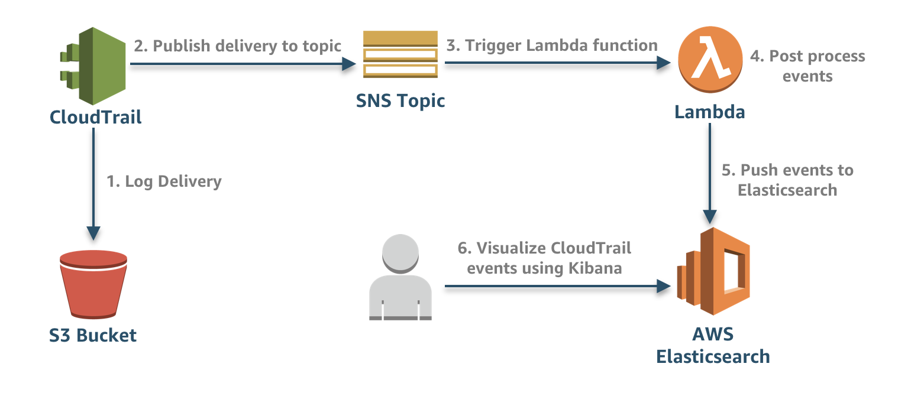

# Processing CloudTrail Logs with AWS Lambda

This serverless application creates the necessary resources and integrations for properly enabling and processing CloudTrail logs in your environment. The below architecture showcases how logs are stored, post-processed, and push to Elasticsearch.

## Architecture

## Prerequisites

*	[Serverless Framework](https://serverless.com/)

*	[AWS Account](https://aws.amazon.com/premiumsupport/knowledge-center/create-and-activate-aws-account/)

## Install Dependencies

python -m pip install -r requirements.txt -t ./

## Deploy

## Access